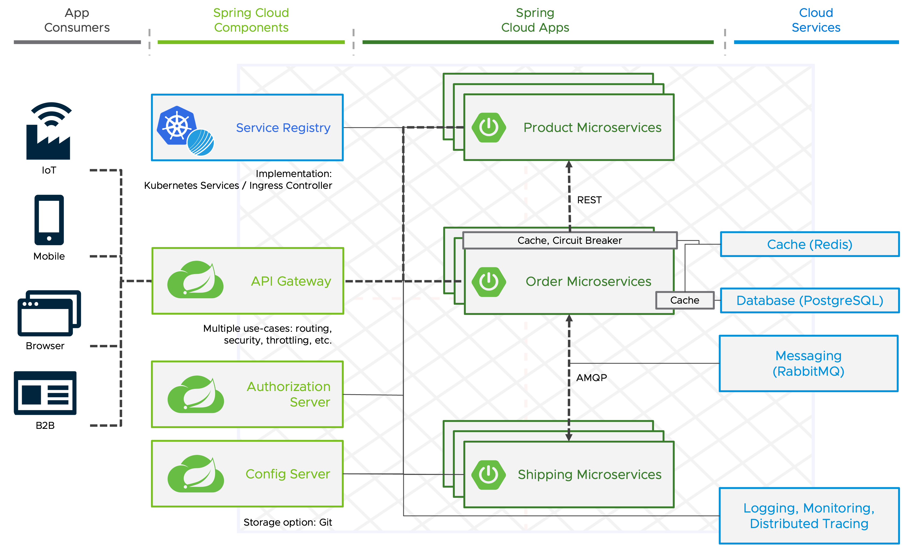

# Demo for a typical Spring Cloud Architecture on VMware Tanzu Application Platform



## Prerequisites
- TAP >=1.3 installation (if you've 1.2 installed, you can have a look at the "tap-1.2" tag)
- [ytt](https://carvel.dev/ytt/)
- The default installation of TAP uses a single Contour to provide internet-visible services. You can install a second Contour instance with service type ClusterIP if you want to expose some services to only the local cluster - which is recommended for this setup. The second instance must be installed in a separate namespace. You must set the CNR value `ingress.internal.namespace` to point to this namespace.
- RabbitMQ operator, Tanzu PostreSQL operator, Tanzu Gemfire operator, Tanzu Observability
- Queue Supply Chain (https://docs.vmware.com/en/VMware-Tanzu-Application-Platform/1.2/tap/GUID-workloads-queue.html)


## Setup

```
export DEV_NAMESPACE=<dev-namespace>
```

### Ops (should be automated and provided as self-service for prod env)

```
kubectl apply -f tap/ops/scan-policy.yaml -n <dev-namespace>
```

#### Config Server
Create a (private) Git repository with the the files in the `generated/config-server-config` directory after running the following ytt commands.
```
mkdir generated/config-server-config

ytt -f tap/ops/config-server-git-config-templates/gateway.yaml -v namespace=$DEV_NAMESPACE > generated/config-server-config/gateway.yaml
ytt -f tap/ops/config-server-git-config-templates/order-service.yaml -v namespace=$DEV_NAMESPACE > generated/config-server-config/order-service.yaml
cp tap/ops/config-server-git-config-templates/product-service generated/config-server-config/
cp tap/ops/config-server-git-config-templates/shipping-service.yaml  generated/config-server-config
```

```
kubectl create secret generic configserver-secret --from-literal=git-url=https://github.com/<user>/<config-repo>.git --from-literal=username=<git-username> --from-literal=password=<git-personal-access-token> -n $DEV_NAMESPACE
kubectl apply -f tap/ops/config-server.yaml -n $DEV_NAMESPACE
```

#### App SSO
For a TLS setup:
```
ytt -f tap/ops/auth-server-template.yaml -v dev_namespace=$DEV_NAMESPACE -v issuer_uri=https://authserver-1-${DEV_NAMESPACE}.example.com -v tls_secret_name=<namespace>/<secret> | kubectl apply -f -
```

Otherwise:
```
ytt -f tap/ops/auth-server-template.yaml -v dev_namespace=$DEV_NAMESPACE -v issuer_uri=http://authserver-1-${DEV_NAMESPACE}.example.com | kubectl apply -f -
```

#### Observability
```
ytt -f tap/ops/observability-template.yaml -v uri=https://vmwareprod.wavefront.com -v api_token=<token> | kubectl apply -n $DEV_NAMESPACE -f -
```

#### Gemfire
```
tanzu secret registry add tanzu-net-registry \
  --username <tanzunet-username> --password <tanzunet-pw> \
  --server registry.tanzu.vmware.com \
  --yes --namespace $DEV_NAMESPACE
```

```
kubectl apply -f tap/ops/gemfire.yaml -n $DEV_NAMESPACE
```

#### PostgeSQL
```
kubectl apply -f tap/ops/postgres.yaml -n $DEV_NAMESPACE
```

#### RabbitMQ
```
kubectl apply -f tap/ops/rabbit.yaml -n $DEV_NAMESPACE
```

### Devs:
```
kubectl apply -f tap/test-pipeline.yaml -f -n $DEV_NAMESPACE
ytt -f tap/auth-client-template.yaml -v gateway_url=https://gateway-${DEV_NAMESPACE}.example.com | kubectl apply -n $DEV_NAMESPACE -f -
kubectl apply -f tap/workload-product-service.yaml -n $DEV_NAMESPACE
kubectl apply -f tap/workload-order-service.yaml -n $DEV_NAMESPACE
kubectl apply -f tap/workload-shipping-service.yaml -n $DEV_NAMESPACE
```

````
sed -i '' "s/https:\/\/authserver-1-dev-space.emea.end2end.link/https:\/\/authserver-1-${DEV_NAMESPACE}.example.com/g" frontend/src/environments/environment.prod.ts
kubectl apply -f tap/workload-frontend.yaml -n $DEV_NAMESPACE
```
